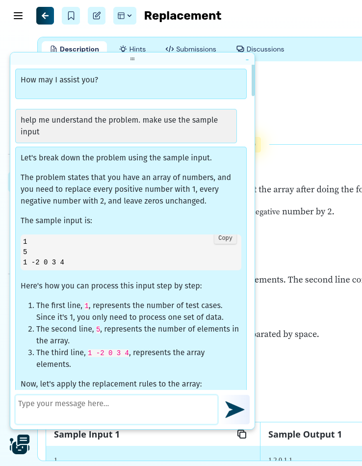
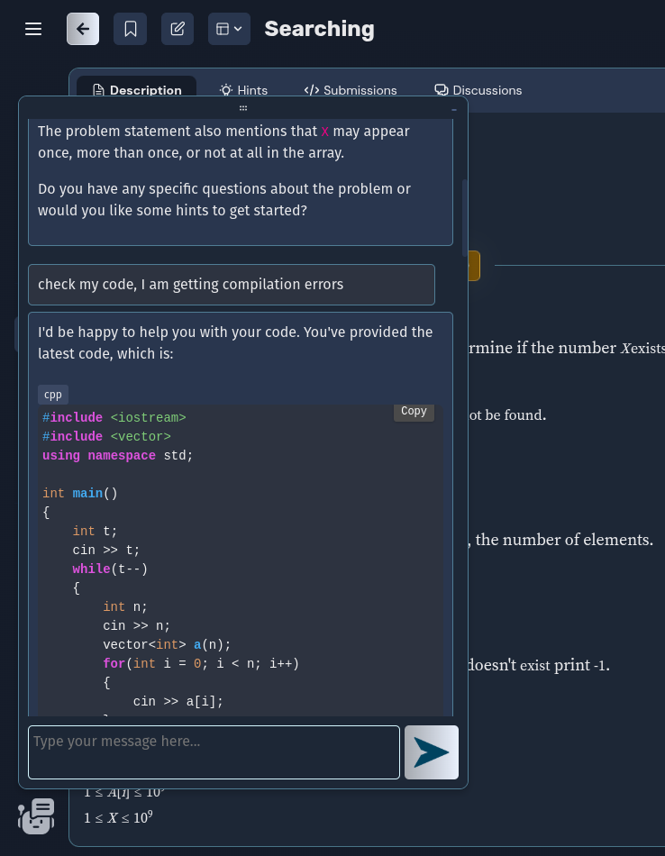

# AI Coding Assistant - Algozenith

## Overview
This Chrome extension integrates an AI assistant directly into the `maang.in` Algozenith coding platform to help users solve coding problems effectively. It guides users by providing hints, suggesting solution approaches, and assisting in logic-building for specific coding challenges.

  
  

## Features
- **Context-Aware AI Guidance**: Provides tailored hints, strategies, and step-by-step guidance to tackle coding challenges effectively.
- **Comprehensive Problem Analysis**: Breaks down problem statements into simpler, more understandable components to enhance comprehension.
- **Code Review Assistance**: Tracks the user’s most recently written code and offers constructive feedback for improvement.
- **Seamless Theme Integration**: Adapts flawlessly to both light and dark themes of the `maang.in` platform, ensuring a consistent visual experience.
- **Customizable Chat Interface**: Features a resizable and draggable chatbox, allowing users to adjust its position and size as needed.
- **Persistent Context Management**: Retains chat history for each problem to maintain context. Automatically clears inactive chats after two days, enabling a fresh start for new problem-solving sessions.
- **Keyboard Shortcut for Quick Access**: Includes a convenient shortcut (`Alt+A`) to instantly open the AI chatbox.
- **Code Copy Feature**: A copy button is available on code blocks, allowing users to copy code effortlessly for reuse and testing.

## Technology Stack
- **Manifest Version**: MV3 (Manifest Version 3)
- **Frontend**: HTML, CSS, JavaScript
- **Model**: llama-3.1-70b-versatile
- **API Platform**: Grog

## Installation
1. Clone or download the repository.
2. Open Chrome and navigate to `chrome://extensions/`.
3. Enable **Developer mode** (toggle at the top-right corner).
4. Click on **Load unpacked** and select the project folder.
5. The extension will appear in your extensions bar.

## Usage
1. Navigate to any problem page of `maang.in`. The AI assistant button will appear on the buttom left corner.
2. Click on the extension icon and enter the API Key. It will get saved in your browser.
4. Start a chat by clicking the button or using "Alt+A" shortcut  to get hints, solution approaches, and logic-building support for the coding problems.

## License
This project is licensed under the MIT License. See the LICENSE file for details.

---

I hope this AI assistant enhances your coding experience on `maang.in`. Happy coding!
